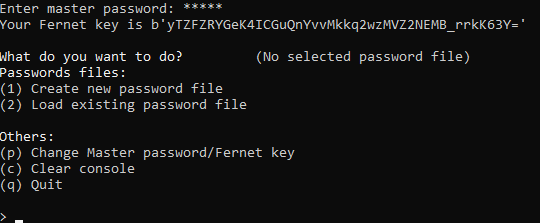
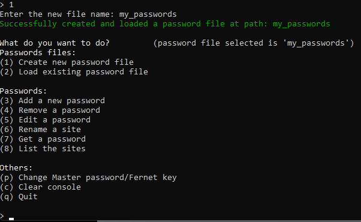
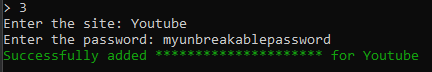
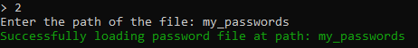
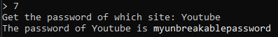
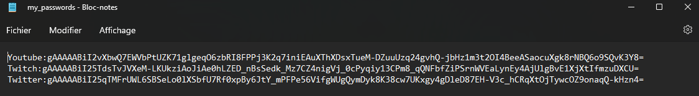

# Password Manager
Created for personal use but good to share

# Use
This python script will create file(s) without extension (PasswordFile). \
These files are openable in a text editor and contains your encrypted passwords
Passwords are encrypted/decrypted thanks to a "Master Password" asked at the launch of the program.

You can create a PasswordFile after giving your "Master Password".

Choose the option "Create new password file" by typing '1' or 'create'

You can now add the password you want for the site wanted or try the other commands

When coming back to get your password, you must enter the same "Master Password" otherwise the decryption will raise some errors.\
You can then "Load existing password file" by typing '2' or 'load' and give the name of your PasswordFile

And get your passwords of your sites by using the command "Get a password" by typing '7' or 'get'

# Encrypted files (PasswordFiles)
There is the result of the PasswordFile when encrypting "myunbreakablepassword", "artyulemeilleurstreamer", "idkiforgotmypassword" with "admin" as the MasterPassword 

# Py libraries to install:
cryptography --> encrypting and decrypting password \
stdiomask --> Password input (hiding the text in asterisks) \
colorama + termcolor --> Colored messages in console

# Improvements added:
- Added an option to store a new automatically generated password
- Added an option to change the fernet key of a file (means the user can change the master password needed for a file)
- Added the choice to copy in clipboard a password or print it in the console
- Added a command to get a list of PasswordFiles in the same directory as the 'main.py' file
